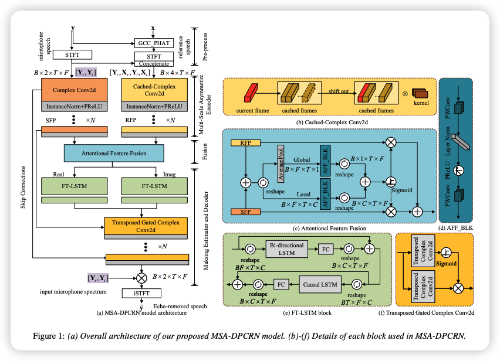

<p align="center">
  <h1 align="center">MSA-DPCRN: A Multi-Scale Asymmetric Dual-Path Convolution Recurrent Network with Attentional Feature Fusion for Acoustic Echo Cancellation</h1>
  <p align="center">
    Ye Ni, Cong Pang, Chengwei Huang, Cairong Zou<br>
  </p>
  <p align="center" >
    <em>Southeast University, Nanjing, China<br> Zhejiang Lab, China</em>
  </p>
  <p align="center">
    <a href='https://www.isca-archive.org/interspeech_2024/ni24_interspeech.pdf'>
      
    </a>
  </p>
  <p align="center">
    
  </p>
</p>

This is the official code repository for [MSA-DPCRN: A Multi-Scale Asymmetric Dual-Path Convolution Recurrent Network with Attentional Feature Fusion for Acoustic Echo Cancellation](https://www.isca-archive.org/interspeech_2024/ni24_interspeech.pdf) If you find our work useful for your research and applications, please cite using this BibTeX:

```bibtex
@inproceedings{ni2024msa,
  title={MSA-DPCRN: A Multi-Scale Asymmetric Dual-Path Convolution Recurrent Network with Attentional Feature Fusion for Acoustic Echo Cancellation},
  author={Ni, Ye and Pang, Cong and Huang, Chengwei and Zou, Cairong}
}
```


# Inference

The model inference script `run.py` takes two arguments: the wave file paths of the microphone and reference speech, e.g.,

```python
python run.py --mic mic_wav_path --ref ref_wav_path
```

The echo-removed speech will be saved in the `out.wav` to the current directory.

# Samples

The `samples` directory contains the self recorded samples under far-end single talk scenario.

# Scripts to generate dataset

- The code to generate the training dataset is in `augment_util.py` which loads the settings in `aug.cfg`. 

You need to modify the `aug.cfg` file to specifiy the path of the DNS, the AEC challenge dataset, and the output directory before running the following commands to generate the training dataset:

```python
python augment_util.py
```

- The code to synthesis the recorded test dataset is in `concat_clean_speech.py`.

You can synthesis the test dataset with the following commands using our recorded FE and LibriSpeech samples:

```python
python concat_clean_speech.py --gene --sph_dir /path/to/librispeech_train/dev-clean --out_dir /path/to/output
```

